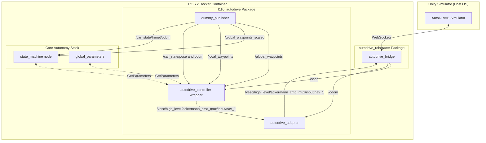

# AutoDRIVE Simulator Autopilot & Control Adapter

This package contains the ROS 2 integration, launch configurations, and actuator control systems to run the F1TENTH modular autonomy stack inside the AutoDRIVE simulator.

---

## Features & Work Accomplished

We have implemented three major components in this package:

### 1. Actuator Feedback & Steering Compensation (`autodrive_adapter`)
To enable stable closed-loop speed tracking under different driving scenarios, the adapter node bridges simulator actuators with the following features:
* **Steering Drag Compensation**: Combats speed drops in tight turns by scaling feedforward throttle with steering angle:
  $$u_{\text{steer\_comp}} = u_{\text{ff}} \cdot (1.0 + K_{\text{steer}} \cdot u_{\text{steer}}^2)$$
* **Zone-Bounded Feedback Control (PID)**: Active only when the absolute speed error is within a bounded window (`e_zone`). This eliminates steady-state errors while preventing integrator windup during large setpoint transitions or startup.
* **Low-Pass Filtered Derivative Damping**: Passes raw speed derivative errors through a first-order Low-Pass Filter (LPF) with parameter `alpha` to filter simulator noise and prevent actuator chattering/oscillations at high speeds.

### 2. Follow-the-Gap (FTG) Autopilot Launcher (`autodrive_ftg_launch.xml`)
Consolidates the modular autonomy stack to run the Follow-the-Gap local planner reactively on the track without needing full SLAM, state estimation, or trajectory planning nodes:
* **Global Parameters Server**: Starts `global_parameter_node` to supply workspace configs.
* **State Machine Node**: Runs `state_machine` with local parameter overrides (`safety_radius`, `max_lidar_dist`, `max_speed`, etc.) to preserve core stack configurations.
* **Dummy Topics Simulation (`dummy_publisher`)**: Publishes mock data to `/global_waypoints`, `/global_waypoints_scaled`, `/local_waypoints`, and car state topics to satisfy startup safety checks. Includes exactly two waypoints to satisfy Scipy's `CubicSpline` path interpolation.
* **Node Wrapper (`autodrive_controller`)**: Monkey patches the core stack's `controller_manager` at runtime to initialize `self.l1_params` in FTG mode and delay execution until the first `/scan` message arrives, avoiding startup crashes without modifying stack files.
* **Wall Time Compatibility**: Configures `use_sim_time` to `False` since the AutoDRIVE simulator runs on system time (no `/clock` topic).

### 3. Integrated Simulator Bridge (`autodrive_roboracer`)
We moved the `autodrive_roboracer` package from the external `autodrive_devkit` workspace directly into our main source workspace.
* **WSL & Windows Friendly**: Running the bridge inside the same container as the ROS stack bypasses sequence size and network serialization errors across container boundaries, allowing it to communicate with the simulator running on the Windows host over TCP WebSockets.
* **Unified Launcher**: Added a `launch_bridge` option (enabled by default) to start the WebSocket bridge automatically alongside all other stack nodes in a single command.

---

## System Architecture



---

## Launch Parameters

The launch file arguments allow configuring parameters for both Follow-the-Gap and the control adapter:

### Follow-the-Gap Parameters
Passed to the state machine node block:
* `safety_radius` (default `15`): Laser index sweep margin to inflate obstacles.
* `max_lidar_dist` (default `10.0`): Lidar scan distance clipping range.
* `max_speed` (default `3.0`): Max target speed in m/s.
* `range_offset` (default `180`): Angle cutoff index (yielding 180° field of view).
* `track_width` (default `3.0`): Approximate racetrack track width.

### Control Adapter Parameters
Passed to the adapter node block (can be set to non-zero values to tune closed-loop feedback):
* `K_steer` (default `0.15`): Cornering drag compensation gain.
* `K_p` (default `0.0`): Proportional speed error gain.
* `K_i` (default `0.0`): Integral speed error gain.
* `K_d` (default `0.0`): Derivative speed error gain.
* `e_zone` (default `0.5`): Error band for feedback control activation.
* `I_max` (default `0.2`): Integral windup boundary limit.
* `alpha` (default `0.25`): First-order low-pass filter coefficient for derivative damping.

### Bridge Options
* `launch_bridge` (default `True`): Launches the simulator WebSocket bridge. Set to `False` if you prefer to run it manually or externally.

---

## How to Run

1. Start the AutoDRIVE Unity simulator on your host OS.
2. Build and source your workspace (inside the container):
   ```bash
   colcon build --symlink-install --packages-select f110_autodrive autodrive_roboracer
   source install/setup.bash
   ```
3. Run the unified autopilot launcher:
   ```bash
   ros2 launch f110_autodrive autodrive_ftg_launch.xml
   ```
